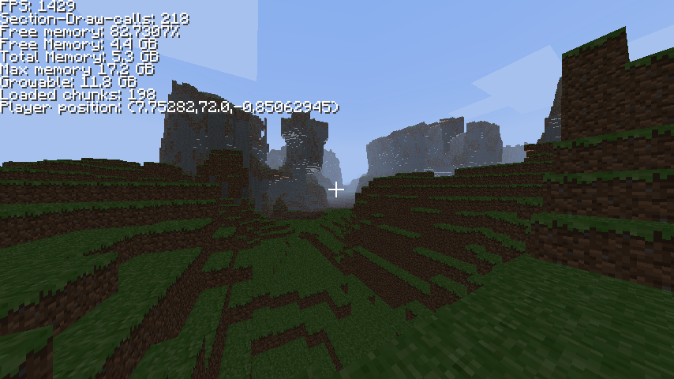
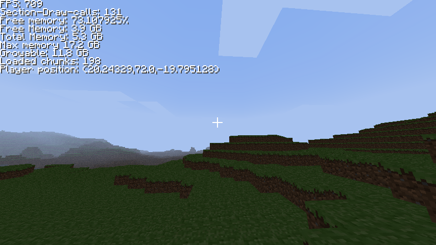
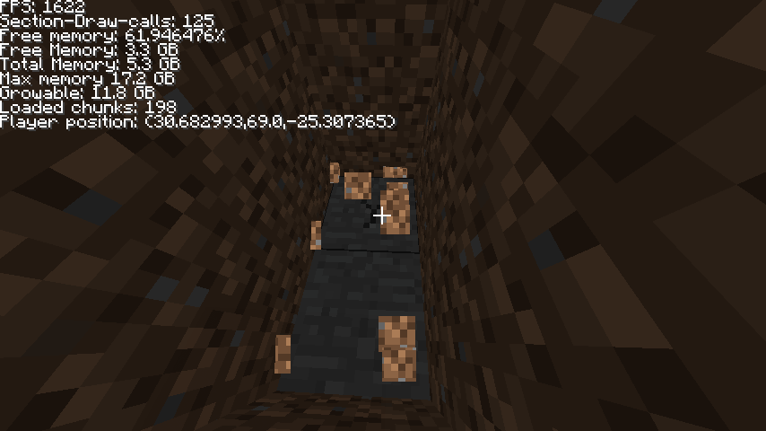

# A Minecraft Recode using LibGDX

It aims to resemble the physics and gameplay as closely as possible, while drastically improving the game's performance,
even on low-end hardware. Thanks to rigorous draw-call optimization, the game is basically always GPU-bound, even on
my RTX-2060.
The mesh building is also optimized to the point, where the player can fly with speeds of 2000 blocks per second without
the chunk or mesh generation falling behind.

## Screenshots

